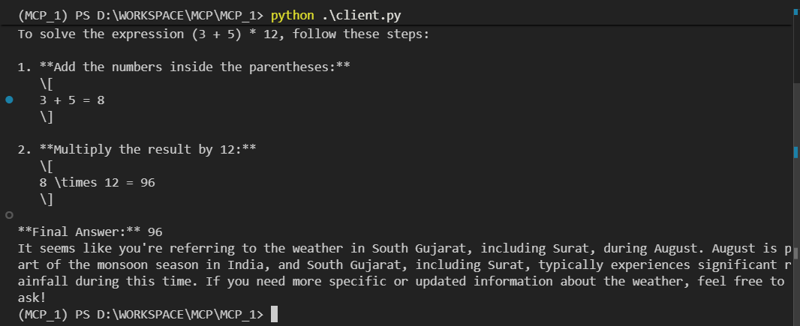
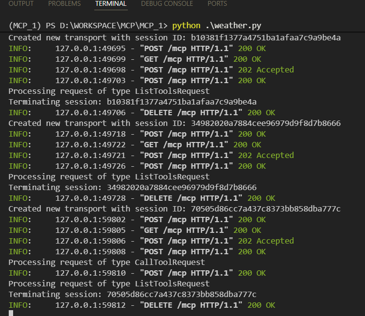

# MCP Math and Weather Demo

This project demonstrates a simple Model Context Protocol (MCP) implementation with two servers and a client. The math server provides basic arithmetic operations (addition and multiplication), while the weather server offers location-based weather information. The client connects to both servers using LangGraph and Groq's AI models to process user queries.



## Setup

1. Install dependencies: `uv sync`
2. Create a `.env` file with your `GROQ_API_KEY`
3. Activate the virtual environment: `.\.venv\Scripts\activate` (Windows) or `source .venv/bin/activate` (Unix)

## Usage
```
1. first create virtual environment 
    - uv init
    - uv venv    
    - .venv\Scripts\activate

2. make requirements and then
    - uv add -r .\requirements.txt
```

Run the client to interact with both MCP servers:

```bash
python client.py
```

The client will demonstrate math calculations and weather queries using the connected MCP servers. The math server runs locally via stdio transport, while the weather server uses HTTP transport and must be started separately with `python weather.py`.

## Weather Tool in Action

