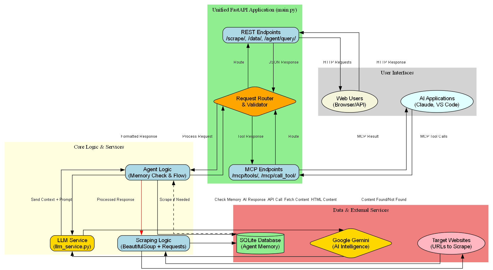
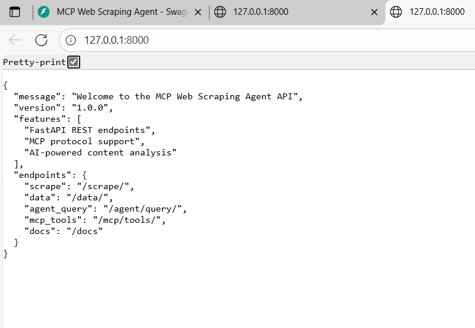
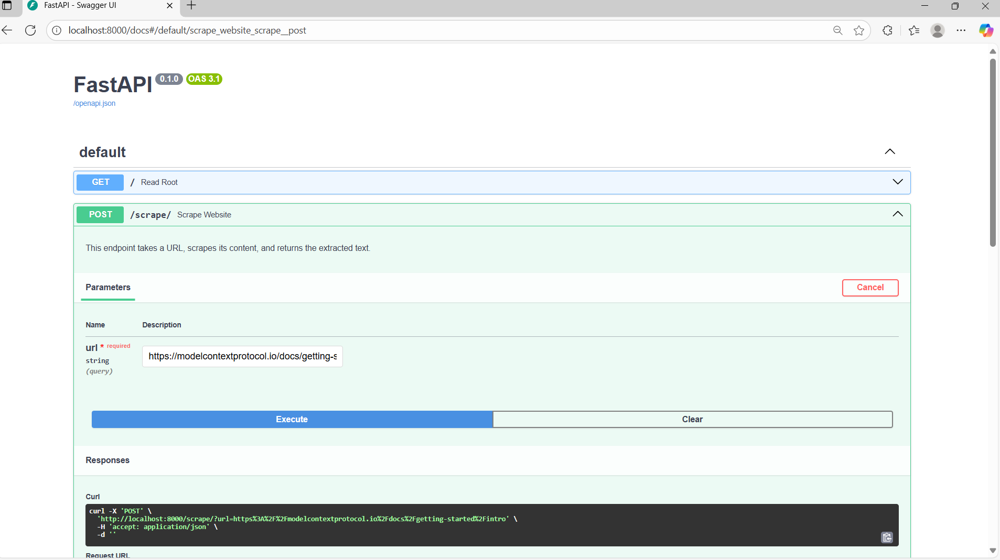
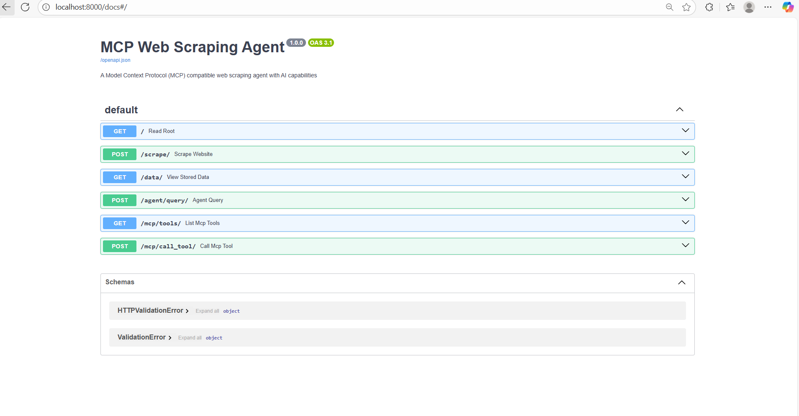
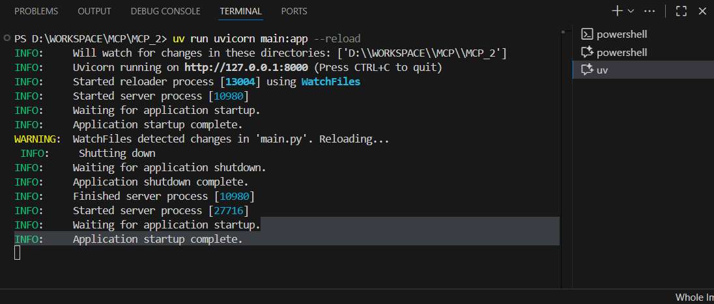

# MCP-2 Web Scraping Agent

## Overview

The MCP-2 project is an intelligent web scraping agent built with the **Model Context Protocol (MCP)** and FastAPI. It provides both a standalone API and an MCP server for seamless integration with AI applications. This agent extracts, processes, and analyzes web content using advanced AI capabilities through Google Gemini integration.

The system combines web scraping, persistent storage, and AI-powered analysis to create a comprehensive tool for content intelligence. It supports both traditional REST API interactions and modern MCP protocol communication, making it highly versatile for various integration scenarios.



*The diagram above shows the complete workflow of the MCP Web Scraping Agent, from user interaction through content processing to AI-powered responses.*

## Architecture

The agent follows a modular architecture with clear separation of concerns:

- **Unified Application** (`main.py`): Combines FastAPI REST endpoints with MCP-compatible tool endpoints
- **LLM Service** (`llm_service.py`): Handles Google Gemini integration for intelligent responses
- **Database Layer** (`database.py`): Manages persistent storage using SQLite
- **Workflow Visualization** (`scripts/visualize_workflow.py`): Generates architecture diagrams
- **Testing Suite** (`scripts/test_*.py`): Comprehensive testing utilities

## Features



*Model Context Protocol integration for seamless AI application connectivity*

- **MCP Server**: Full Model Context Protocol implementation for AI application integration
- **REST API**: Traditional HTTP endpoints for web-based interactions
- **Seamless Integration**: Works with Claude Desktop, VS Code extensions, and other MCP-compatible tools

- **Google Gemini Integration**: Advanced language model for content analysis and Q&A
- **Context-Aware Responses**: Answers based specifically on scraped content to minimize hallucination
- **Intelligent Memory**: Automatic content caching and retrieval optimization

- **Multi-Library Support**: BeautifulSoup4 and Crawl4AI for comprehensive content extraction
- **Clean Content Processing**: Converts raw HTML to clean, LLM-friendly text
- **Error Resilience**: Robust handling of network issues and malformed content

- **SQLite Database**: Lightweight, file-based storage for scraped content
- **Automatic Deduplication**: Smart handling of duplicate URLs with timestamp tracking
- **Fast Retrieval**: Optimized queries for content lookup and search


## Dependencies

- **FastAPI**: Modern web framework for API development with automatic documentation
- **uvicorn**: High-performance ASGI server for FastAPI applications
- **Pydantic**: Data validation and settings management

- **requests**: HTTP library for web content fetching
- **BeautifulSoup4**: HTML parsing and content extraction
- **Crawl4AI**: Advanced web scraping with AI optimization

- **google-generativeai**: Google Gemini API client for advanced language processing
- **python-dotenv**: Secure environment variable management

- **sqlite3**: Built-in Python database (no installation needed)
- **pandas/numpy**: Data processing and analysis capabilities

- **graphviz**: Professional workflow diagram generation
- **pytest**: Testing framework for comprehensive test coverage


*Advanced FastAPI features including automatic API documentation and validation*

All dependencies are managed through `pyproject.toml` with proper version constraints for stability and security. Install all dependencies with: `uv pip install -e .`

## Usage

### 🔧 **MCP Server Mode** (Recommended)

Start the MCP server for integration with AI applications:

```bash
python main.py --mcp
```

The server provides these tools through the MCP protocol:
- `scrape_website`: Extract and store content from URLs
- `query_agent`: Ask AI questions about scraped content  
- `get_stored_data`: View all stored content
- `search_content`: Search through stored content


Access the interactive documentation at: http://127.0.0.1:8000/docs


*Interactive API documentation with Swagger UI for easy testing and exploration*



*Command-line testing and development workflow*


### **MCP Tools**

| Tool | Description | Parameters |
|------|-------------|------------|
| `scrape_website` | Extract content from a URL | `url`: Website URL to scrape |
| `query_agent` | AI-powered content analysis | `url`: Target URL, `prompt`: Question/instruction |
| `get_stored_data` | List all scraped content | None |
| `search_content` | Search stored content | `query`: Search terms |

###  **REST Endpoints**

| Method | Endpoint | Description | Parameters |
|--------|----------|-------------|------------|
| GET | `/` | Health check and welcome | None |
| POST | `/scrape/` | Scrape website content | `url`: Website URL |
| GET | `/data/` | View stored data | None |
| POST | `/agent/query/` | AI content analysis | `url`: URL, `prompt`: Question |


## Configuration

The application can be configured through environment variables or by modifying the main.py file directly. Currently, the configuration is minimal, with the server host and port controlled by uvicorn parameters. Future versions may include configuration files for custom settings such as request timeouts, user agents, and content filters.

## LLM Integration

The agent incorporates Google Gemini as its intelligence layer through the llm_service.py module. This service configures the Gemini API client, constructs contextual prompts combining scraped webpage content with user queries, and generates responses based solely on the provided context to minimize hallucination. The system prompt ensures the LLM acts as a helpful assistant focused on the webpage content.


## Contributing

Contributions to the MCP-2 project are welcome. To contribute, fork the repository, create a feature branch, and submit a pull request with your changes. Ensure that your code follows the existing style and includes appropriate tests. For major changes, please open an issue first to discuss the proposed modifications.

## License

This project is licensed under the MIT License. You are free to use, modify, and distribute the code as long as the original license terms are maintained.