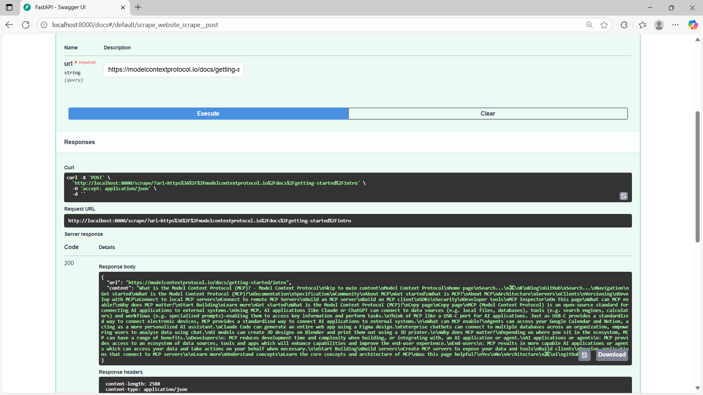

# MCP-2 Web Scraping API

## Overview

The MCP-2 project is a web scraping API built using FastAPI, designed to provide a simple and efficient way to extract text content from web pages and store it persistently. This application serves as a scraping agent that accepts URLs, processes them into clean Markdown using Crawl4AI, and maintains a local SQLite database for data persistence. The API is lightweight, asynchronous, and suitable for integration into larger systems or for standalone use in data collection and analysis tasks.

The core functionality revolves around scraping endpoints that take a URL as input, fetch the page content using advanced web scraping techniques, convert it to structured Markdown, and store the results in a database for future reference. Error handling is implemented to manage network issues and invalid URLs gracefully. The application uses modern Python libraries for web scraping and data storage, ensuring reliable performance and ease of maintenance.

## Features

This API offers several key features that make it a robust tool for web scraping and data collection. It supports asynchronous request handling, which allows for high concurrency and efficient resource usage. The scraping process uses Crawl4AI to produce clean, LLM-friendly Markdown content from web pages, preserving structure while removing clutter. Comprehensive error handling provides clear feedback for failed requests, distinguishing between network errors and other exceptions.

The application includes persistent data storage using SQLite, allowing the agent to maintain memory of previously scraped content. This enables building knowledge bases and prevents redundant scraping of the same URLs. The data storage system automatically updates existing entries when the same URL is scraped again, ensuring the most recent content is always available. The application is designed with extensibility in mind, allowing for future enhancements such as selective content extraction, advanced filtering, or integration with different scraping libraries. The FastAPI framework provides automatic API documentation generation, making it easy for developers to understand and integrate with the service.

## Installation

To set up the MCP-2 Web Scraping API on your system, you will need Python 3.12 or higher. The project uses uv for dependency management, which provides fast and reliable package installation. First, ensure you have uv installed on your system. Then, clone the repository and navigate to the project directory.

Run the following command to install all required dependencies:

```
uv pip install -r pyproject.toml
```

This command will resolve and install all the packages listed in the pyproject.toml file, including FastAPI, requests, and BeautifulSoup4. If you encounter any permission issues during installation, try running the command with administrator privileges or check that your virtual environment is properly activated.

For additional scraping capabilities, you can install the crawl4ai library with Playwright support:

```
uv pip install "crawl4ai[playwright]"
```

This optional installation adds advanced web scraping features that can handle JavaScript-rendered content and provide more sophisticated extraction options.

## Usage

Once installed, you can start the API server using uvicorn. The application runs on localhost port 8000 by default and includes auto-reload functionality for development. Execute the following command from the project root directory:

```
uv run uvicorn main:app --reload
```

The server will start and display connection information in the terminal. You can access the API documentation at http://127.0.0.1:8000/docs, which provides an interactive interface for testing the endpoints.


To test the scraping functionality, you can use curl or any HTTP client. Send a POST request to the /scrape/ endpoint with a JSON payload containing the URL to scrape:

```
curl -X POST "http://127.0.0.1:8000/scrape/" -H "Content-Type: application/json" -d '{"url": "https://example.com"}'
```

The response will be a JSON object containing the scraped URL and the extracted text content.



For command-line testing, you can use tools like curl or integrate the API into your applications using Python's requests library or any HTTP client.


## API Endpoints

The API currently exposes three endpoints. The root endpoint at GET / provides a welcome message and serves as a health check for the service. The primary scraping functionality is available through the POST /scrape/ endpoint, which accepts a JSON payload with a single "url" field and uses Crawl4AI to extract clean Markdown content, storing it in the local SQLite database. The GET /data/ endpoint allows viewing all stored scraped data, providing the agent with persistent memory.

The scraping endpoint performs several operations: it validates the input URL, uses Crawl4AI to fetch and process the content into LLM-friendly Markdown, checks for successful extraction, and stores the result in the database with a timestamp. If any step fails, the endpoint returns an error message with details about the failure. The data endpoint returns a JSON array of all stored records, ordered by scrape time.

## Dependencies

The project relies on several key Python packages. FastAPI provides the web framework with automatic API documentation. Crawl4AI with Playwright support handles advanced web scraping, capable of processing JavaScript-rendered content and producing clean Markdown output. SQLite3 is used for local data persistence, requiring no additional setup as it's included with Python.

Optional dependencies include numpy and pandas for potential data analysis features, and requests with BeautifulSoup4 for alternative scraping methods. All dependencies are specified in the pyproject.toml file with version constraints to ensure compatibility and security.

## Configuration

The application can be configured through environment variables or by modifying the main.py file directly. Currently, the configuration is minimal, with the server host and port controlled by uvicorn parameters. Future versions may include configuration files for custom settings such as request timeouts, user agents, and content filters.

## Error Handling

The API implements comprehensive error handling to provide reliable operation. Network-related errors, such as connection timeouts or invalid URLs, are caught and returned as JSON error responses. HTML parsing errors and unexpected exceptions are also handled gracefully, ensuring the API remains stable under various conditions.

## Contributing

Contributions to the MCP-2 project are welcome. To contribute, fork the repository, create a feature branch, and submit a pull request with your changes. Ensure that your code follows the existing style and includes appropriate tests. For major changes, please open an issue first to discuss the proposed modifications.

## License

This project is licensed under the MIT License. You are free to use, modify, and distribute the code as long as the original license terms are maintained.