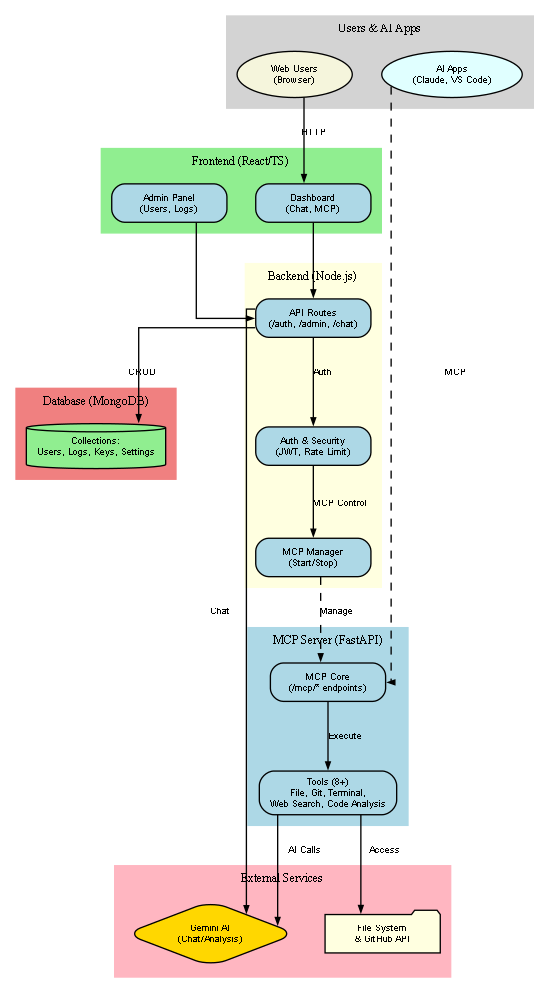
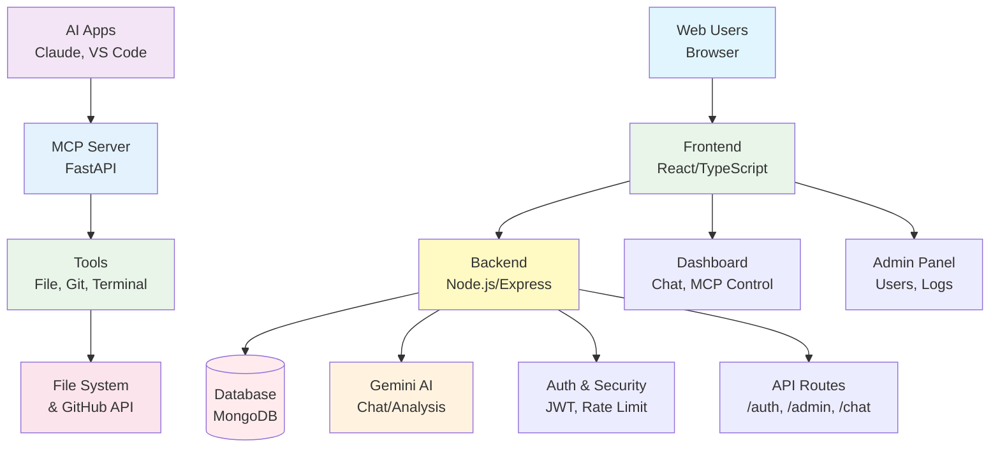

# SensCoder MCP Server

SensCoder is a comprehensive local-first coding assistant platform that integrates a FastAPI-based Model Context Protocol (MCP) server with a full-stack web application. The MCP server serves as the core communication layer between AI assistants and development tools, providing secure, sandboxed access to file systems, Git operations, and system commands while maintaining strict safety boundaries.

The MCP server implements the Model Context Protocol specification, enabling seamless integration with AI assistants like Claude Desktop. It provides a standardized interface for tool invocation, resource access, and prompt management, ensuring consistent and secure interactions between AI models and development environments. The server includes comprehensive safety features including path sandboxing, command filtering, size limits, and timeout protection to prevent unauthorized access or system compromise.

## Architecture Overview

### System Architecture Diagram



### High-Level Component Flow



### Architecture and Components

The platform consists of three main components working in concert:

### MCP Server (FastAPI)
The core MCP implementation provides:
- **Tool Invocation API**: Standardized interface for executing development tools
- **Resource Management**: Access to server information and capabilities
- **Prompt Templates**: Pre-configured prompts for code review, testing, and debugging
- **Safety Sandboxing**: All operations restricted to project boundaries with permission checks

### Backend Service (Node.js/Express)
A RESTful API server handling:
- User authentication and authorization with JWT tokens
- Gemini AI integration for conversational AI features
- Comprehensive activity logging and audit trails
- API key management for external service integrations
- System settings and configuration management

### Frontend Application (React/TypeScript)
A modern web interface featuring:
- Admin dashboard with user management and system monitoring
- Real-time chat interface with Markdown rendering
- API key configuration and monitoring
- Activity logs with filtering and search capabilities
- Responsive design with clean, professional styling

## MCP Server Features

### Core Tools
- **File Operations**: Safe read/write/list operations within project boundaries
- **Git Integration**: Status, log, diff, and repository management operations
- **Command Execution**: Controlled shell command execution with safety filters
- **Mathematical Evaluation**: Safe expression evaluation for calculations
- **Provider Configuration**: Integration with backend AI provider settings

### Safety and Security
- **Path Sandboxing**: All file operations restricted to configured project root
- **Command Filtering**: Dangerous commands automatically blocked
- **Size Limits**: File operations limited to 1MB to prevent resource exhaustion
- **Timeout Protection**: Long-running operations automatically terminated
- **Permission Validation**: All operations respect filesystem permissions

### MCP Protocol Compliance
- **Tool Invocation**: Standardized tool calling with parameter validation
- **Resource Access**: Server information and capability discovery
- **Prompt Management**: Template-based prompt delivery for consistent AI interactions
- **Error Handling**: Comprehensive error reporting with actionable feedback


### Claude Desktop Integration
Add to `claude_desktop_config.json`:
```json
{
  "mcpServers": {
    "senscoder-fastapi": {
      "command": "uvicorn",
      "args": ["app.main:app", "--host", "127.0.0.1", "--port", "5050"],
      "env": {
        "SENSCODER_PROJECT_ROOT": "/absolute/path/to/project",
        "SENSCODER_BACKEND_URL": "http://localhost:4000"
      }
    }
  }
}
```

## API Endpoints

### MCP Server
- `POST /mcp/tool-invoke` - Execute MCP tools
- `GET /mcp/resources` - Retrieve available resources
- `GET /mcp/prompts` - Get prompt templates
- `GET /mcp/health` - Server health check

### Backend API
- `POST /api/auth/login` - User authentication
- `GET /api/admin/users` - User management
- `POST /api/chat/message` - AI chat interactions
- `GET /api/admin/logs` - Activity logs

## Screenshots and Interface

### Application Screenshots

#### Home Page (`assets/home_page.png`)
Main landing page with navigation and feature overview. Displays the application branding and provides access to login and registration.

#### Login Interface (`assets/login.png`)
Secure authentication interface with form validation and error handling. Supports user login with email and password credentials.

#### Dashboard (`assets/dashboard.png`)
Main user dashboard showing chat interface and recent activity. Features real-time messaging with AI assistant and conversation history.

#### Admin Panel Overview (`assets/admin_user.png`)
Administrative interface for user management. Displays user accounts, roles, status, and provides bulk operations for account administration.

#### API Key Management (`assets/admin_api_management.png`)
API key configuration and monitoring interface. Shows active keys, usage statistics, and provides controls for key lifecycle management.

#### Activity Logs (`assets/admin_logs.png`)
Comprehensive logging interface with filtering and search. Displays system activities, user actions, and audit trails with detailed information.

#### Master View (`assets/masterview.png`)
Unified administrative dashboard combining all system information. Provides complete overview of users, API keys, system status, and quick actions.

#### System Architecture

Compact system architecture diagram showing all components and their relationships. Perfect for README embedding and quick reference.

#### Comprehensive Architecture (`assets/senscoder_comprehensive_architecture.png`)
Complete system architecture diagram showing component relationships and data flow between MCP server, backend services, and frontend application.

#### Planning Interface (`assets/plan.png`)
Project planning and task management interface. Supports workflow visualization and project milestone tracking.

## Use Cases

### For Individual Developers
- **Local AI Assistance**: Use Claude Desktop with MCP server for secure, local-first AI coding assistance
- **Project Management**: Track development tasks and maintain organized project workflows
- **Code Review**: Automated code review suggestions and best practice recommendations
- **Debugging Support**: AI-powered debugging assistance with contextual code analysis

### For Development Teams
- **Collaborative Coding**: Shared MCP server instance for team-wide AI assistance
- **Code Quality**: Automated testing and code review workflows
- **Knowledge Sharing**: Centralized prompt templates and coding standards
- **Audit Trails**: Comprehensive activity logging for compliance and oversight

### For Organizations
- **Secure AI Integration**: Sandboxed AI assistance with enterprise security controls
- **Compliance Management**: Audit trails and access controls for regulatory requirements
- **Resource Management**: Centralized API key and resource management
- **Scalable Deployment**: Production-ready architecture supporting multiple users

### Health Checks
- MCP Server: `GET http://localhost:5050/mcp/health`
- Backend API: `GET http://localhost:4000/api/health`

