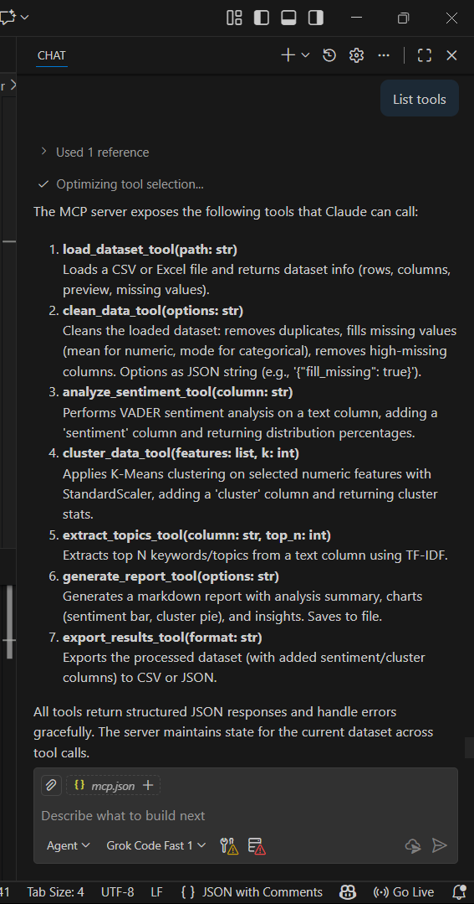
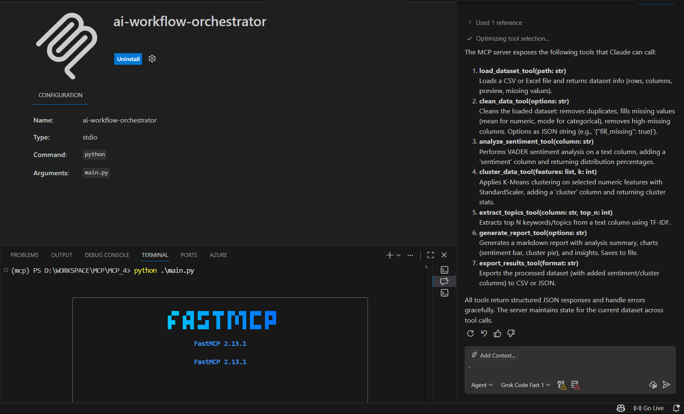
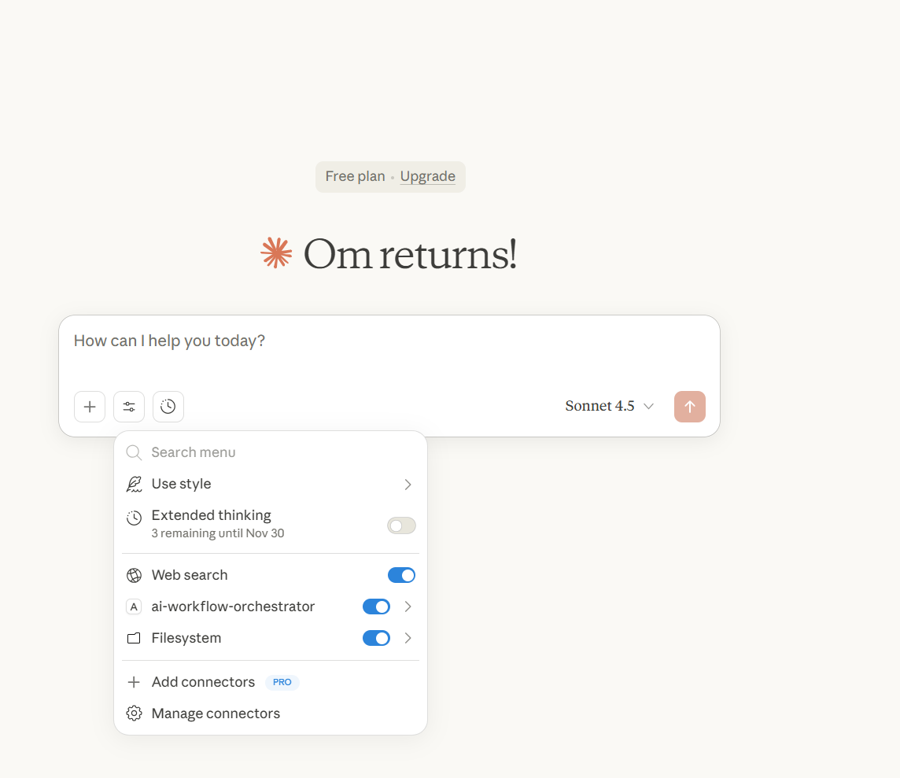
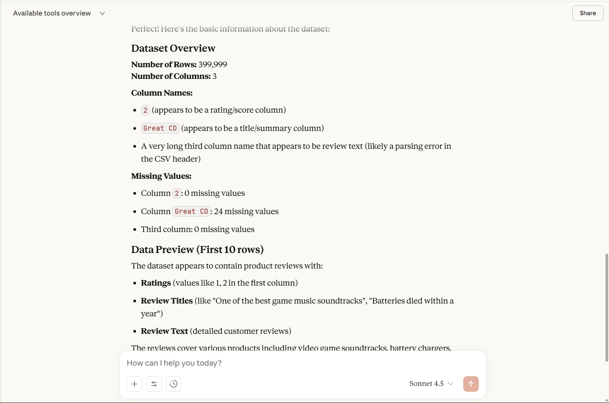
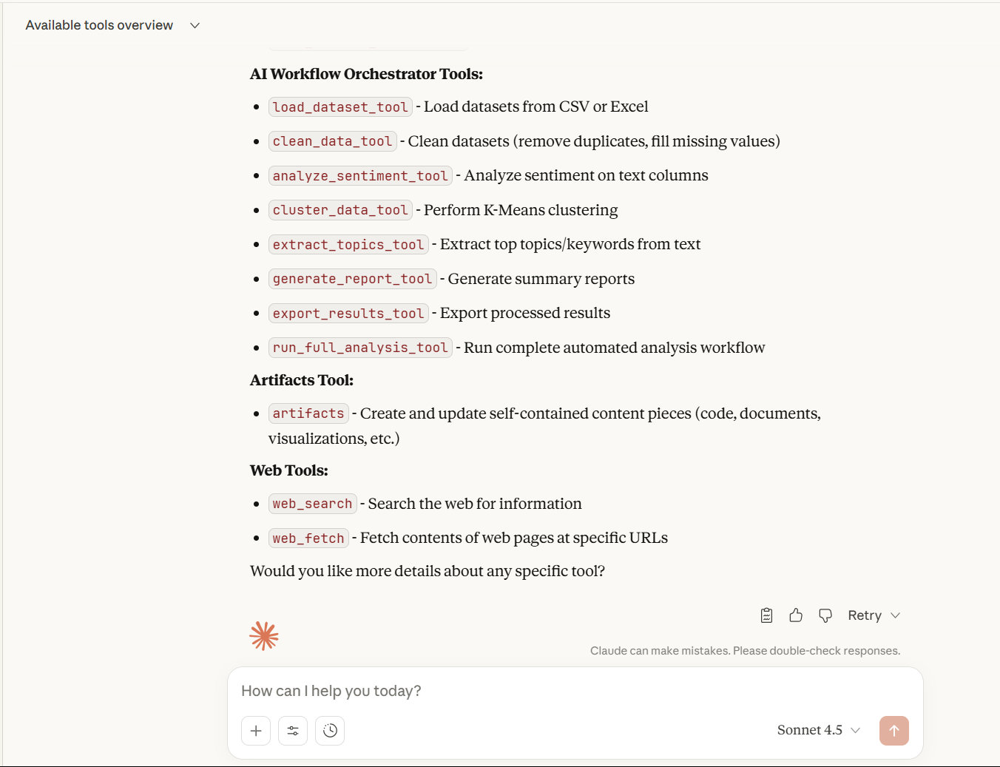
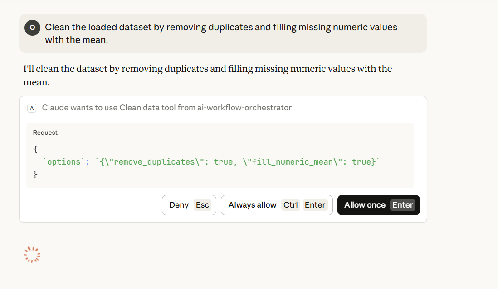
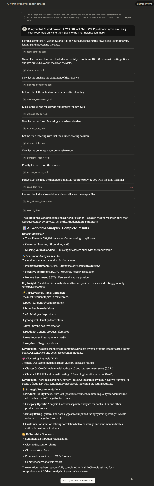

# AI Workflow Orchestrator MCP

A powerful Model Context Protocol (MCP) server for automated data analysis workflows. This server intelligently handles messy datasets, performs sentiment analysis, customer segmentation, topic extraction, and generates comprehensive business insights - all through natural language commands in Claude Desktop.

## Features

- Intelligent Data Loading: Automatically detects file formats (CSV, TSV, JSON, Excel, Parquet) and handles headerless files
- Auto-Column Detection: Smart detection of rating and text columns from any dataset structure
- Sentiment Analysis: VADER-powered sentiment analysis on customer reviews
- Customer Segmentation: K-Means clustering for customer behavior analysis
- Topic Extraction: TF-IDF based keyword extraction from text data
- Automated Reporting: Generates comprehensive analysis reports with visualizations
- Robust Error Handling: Graceful handling of malformed data without crashes
- Production Ready: JSON-based responses, logging, and scalable processing

## MCP Configuration

```json
{
  "mcpServers": {
    "ai-workflow-orchestrator": {
      "command": "D:\\WORKSPACE\\MCP\\MCP_4\\mcp\\Scripts\\python.exe",
      "args": ["D:\\WORKSPACE\\MCP\\MCP_4\\main.py"]
    }
  }
}
```

## Screenshots

### Claude Desktop Integration

*The MCP server integrated with GitHub Copilot in VS Code, showing available tools.*

### Server Startup

*Server startup showing successful initialization and tool registration.*

### VS Code Installation

*VS Code extension installation process for MCP support.*

### Claude MCP Server

*Claude Desktop showing the connected MCP server and available tools.*

### Load Dataset Prompt

*Example of loading a dataset through natural language in Claude.*

### Claude MCP Tools

*List of available MCP tools in Claude Desktop.*

### Clean Dataset

*Data cleaning and preprocessing interface.*

### Output from Claude AI

*Sample output showing analysis results from Claude AI.*

## Installation

### Prerequisites
- Python 3.8+
- Claude Desktop

### Setup
1. Clone this repository
2. Install dependencies:
   ```bash
   pip install -r requirements.txt
   ```

3. Configure Claude Desktop:
   - Add the MCP server to your `claude_desktop_config.json`:
   ```json
   {
     "mcpServers": {
       "ai-workflow-orchestrator": {
         "command": "python",
         "args": ["path/to/main.py"]
       }
     }
   }
   ```

4. Start the server:
   ```bash
   python main.py
   ```

## Usage

### Basic Workflow
The server provides these core tools:

1. Load Dataset: `load_dataset(path, has_headers)`
2. Analyze Sentiment: `analyze_sentiment(data, column)`
3. Cluster Data: `cluster_data(data, features, k)`
4. Extract Topics: `extract_topics(data, column, top_n)`
5. Run Full Analysis: `run_full_analysis(options)`

### Example Commands in Claude

**Simple Analysis:**
```
Run a complete analysis on datasets/amazon_reviews.csv with 3 clusters
```

**Custom Analysis:**
```json
{
  "dataset_path": "datasets/test.csv",
  "text_column": "review_text",
  "rating_column": "rating",
  "k": 3
}
```

## Expected Workflow

Below is a sample analysis report generated by the full workflow on a large customer review dataset:

```markdown
# AI Workflow Orchestrator MCP - Comprehensive Analysis Report
Generated on: 2025-11-23 20:02:47

## Executive Summary
This report provides an automated analysis of customer reviews, including sentiment evaluation, customer segmentation through clustering, and key topic identification. The insights derived can inform product improvements, customer service strategies, and marketing efforts.

## Dataset Overview
- **Total Records**: 399999
- **Features Analyzed**: 6
- **Data Completeness**: 24 missing values across all columns

## Sentiment Analysis
Analysis of 99.99 reviews reveals the following sentiment distribution:
- **Positive**: 70.61 reviews (70.6%)
- **Negative**: 26.01 reviews (26.0%)
- **Neutral**: 3.37 reviews (3.4%)


## Customer Segmentation Analysis
Customers have been segmented into 2 distinct groups using K-Means clustering on rating and sentiment scores.

### Cluster Profiles
#### Cluster 0.0 (200000 customers)
- **Profile**: This cluster shows mixed satisfaction levels requiring further analysis. These customers have varied experiences that don't fit clear patterns.
- **Average Rating**: 1.00/5
- **Average Sentiment Score**: 0.054
- **Strategic Focus**: Conduct deeper analysis of this segment to understand their unique needs.

#### Cluster 1.0 (199999 customers)
- **Profile**: This cluster shows mixed satisfaction levels requiring further analysis. These customers have varied experiences that don't fit clear patterns.
- **Average Rating**: 2.00/5
- **Average Sentiment Score**: 0.695
- **Strategic Focus**: Conduct deeper analysis of this segment to understand their unique needs.


*The scatter plot above shows how customers cluster based on their ratings and sentiment scores. The dashed lines indicate neutral sentiment (horizontal) and neutral rating (vertical) boundaries.*

## Key Business Insights
- Overall customer satisfaction shows 70.6% positive, 3.4% neutral, and 26.0% negative sentiment, indicating strong positive reception that requires celebration.
- Clusters cluster_1.0 show disconnect between numerical ratings and sentiment scores, suggesting customers may be rating specific aspects while expressing broader frustrations in reviews.
- Priority improvement initiatives should target features and pain points mentioned most frequently in negative reviews from low-performing clusters to maximize impact on customer satisfaction.
- Customer success teams should proactively reach out to moderate-satisfaction clusters before they migrate to competitor offerings.

## Recommendations
- **Product Team**: Focus development efforts on features mentioned in negative reviews from low-satisfaction clusters.
- **Customer Service**: Prioritize support for customers in mixed/neutral sentiment segments to prevent churn.
- **Marketing**: Leverage positive sentiment clusters for testimonials and case studies.
- **Quality Assurance**: Implement automated sentiment monitoring for new product releases.
```

## API Reference

### Tools

#### `load_dataset(path: str, has_headers: bool = None) -> str`
Loads a dataset from various file formats with intelligent header detection.

**Parameters:**
- `path`: File path (supports CSV, TSV, JSON, Excel, Parquet)
- `has_headers`: Optional boolean for header presence

**Returns:** JSON with dataset info and preview

#### `analyze_sentiment(data: DataFrame, column: str = None) -> str`
Performs sentiment analysis using VADER.

**Parameters:**
- `data`: Pandas DataFrame
- `column`: Text column name (auto-detected if None)

**Returns:** JSON with sentiment distribution

#### `cluster_data(data: DataFrame, features: list = None, k: int = 3) -> str`
Performs K-Means clustering on numeric features.

**Parameters:**
- `data`: Pandas DataFrame
- `features`: List of numeric columns (auto-detected if None)
- `k`: Number of clusters

**Returns:** JSON with cluster information

#### `extract_topics(data: DataFrame, column: str = None, top_n: int = 10) -> str`
Extracts top keywords using TF-IDF.

**Parameters:**
- `data`: Pandas DataFrame
- `column`: Text column name (auto-detected if None)
- `top_n`: Number of keywords to extract

**Returns:** JSON with top keywords

#### `run_full_analysis(options: str) -> str`
Runs complete analysis workflow.

**Parameters:**
- `options`: JSON string with analysis options

**Example Options:**
```json
{
  "dataset_path": "data.csv",
  "k": 3
}
```

**Returns:** JSON with complete analysis results
