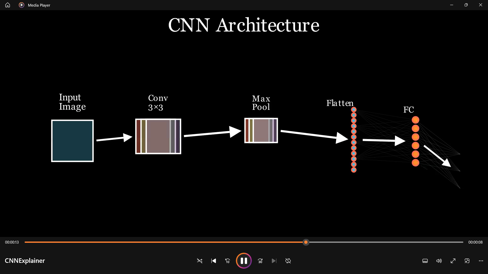
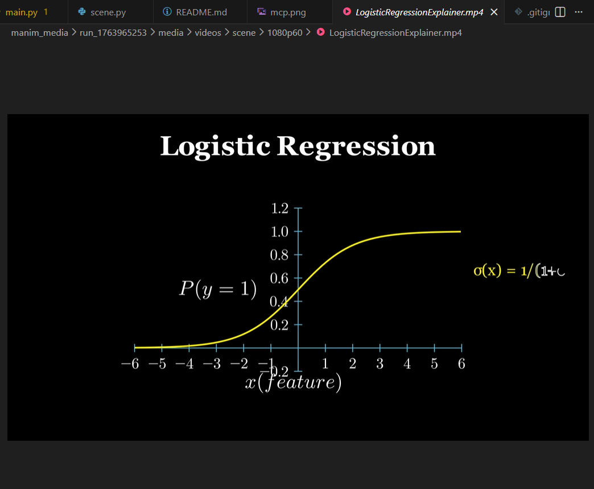
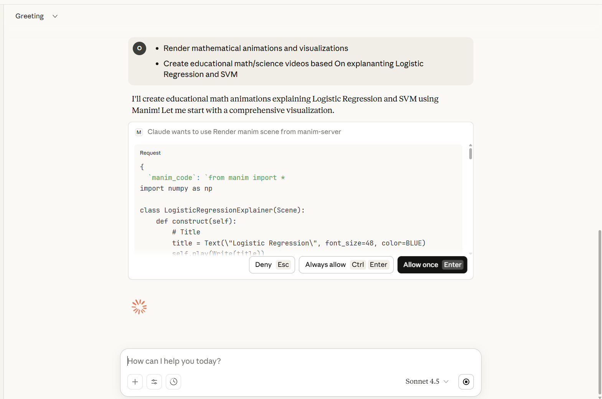

### README.md

# Manim MCP Server

This project provides an MCP (Model Context Protocol) server that acts as a rendering backend for Manim animations. The server does not generate code or interpret natural language; its only responsibility is to render valid Manim Python code into video or image outputs. Any AI client such as Claude generates the Manim code and calls this server programmatically through MCP tools.

The server offers a single primary tool that accepts Manim code, the name of the scene class, and render options such as quality and preview mode. It executes Manim in an isolated temporary directory, returns the paths of the generated media files, and exposes a separate cleanup tool to remove temporary render directories when they are no longer required.

## How It Works

1. The user describes the desired animation in plain English to an AI client (for example, Claude).
2. The AI generates complete Manim Python code with a scene class.
3. The AI invokes the MCP tool `render_manim_scene(manim_code, scene_name, quality, preview)` on this server.
4. The server runs Manim and returns a JSON object containing media output paths, logs, and the temporary directory.
## Screenshots

### Claude Desktop Integration

*Claude Desktop using the Manim MCP server to render educational animations*

### Convolutional Neural Network Animation

*Example CNN visualization showing convolution, pooling, and classification layers*

### Logistic Regression Animation

*Educational animation explaining logistic regression with sigmoid function and decision boundaries*

### MCP Server Architecture

*Model Context Protocol server setup and communication flow*

### Demo Animation

*Sample Manim animation rendered through the MCP server*

