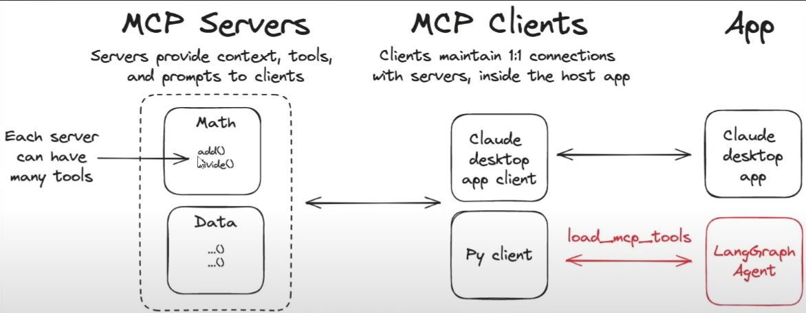

# MCP Server Projects

This repository contains Model Context Protocol (MCP) server implementations that demonstrate how to create and integrate custom tools and data sources with AI applications. MCP is an open-source standard that enables AI applications like Claude or ChatGPT to connect to external systems, data sources, and tools in a standardized way.

Think of MCP like a USB-C port for AI applications. Just as USB-C provides a standardized way to connect electronic devices, MCP provides a standardized way to connect AI applications to external systems. This allows AI models to access key information, perform tasks, and interact with your data and workflows seamlessly.

## What's Included

This repository contains two MCP server implementations:

- **Math Server**: Provides basic arithmetic operations (addition and multiplication) via stdio transport
- **Weather Server**: Offers location-based weather information via streamable-http transport  
- **Client Demo**: Shows how to connect to both servers using LangGraph and Groq's AI models

## Getting Started

1. **Install dependencies**: `uv sync`
2. **Create environment file**: Add your `GROQ_API_KEY` to `.env`
3. **Activate virtual environment**: `.\.venv\Scripts\activate` (Windows) or `source .venv/bin/activate` (Unix)
4. **Run the demo**: `python client.py`

The client will demonstrate math calculations and weather queries using the connected MCP servers. The math server runs locally via stdio transport, while the weather server uses HTTP transport and must be started separately with `python weather.py`.

## Why MCP Matters

MCP enables powerful integrations across the AI ecosystem:

- **Developers**: Reduces complexity when building AI applications with external integrations
- **AI Applications**: Provides access to diverse data sources and tools to enhance capabilities  
- **End Users**: Results in more capable AI assistants that can access your data and take actions

With MCP, you can build AI agents that access your Google Calendar and Notion, create web apps from Figma designs, analyze enterprise databases through chat, or even control 3D printers and other hardware - all through a standardized protocol.

## Projects

Below is a simple, extendable table listing the projects included in this repository. Add a new row for each new project that arrives.

| No. | Project | Description |
| ---: | ------- | ----------- |
| 1 | [MCP_1](./MCP_1) | Math Server (stdio), Weather Server (streamable-http), and a client demo showing how to connect both servers. |
| 2 | [MCP_2](./MCP_2) | FastAPI-based web scraping API that converts pages to LLM-friendly Markdown (Crawl4AI) and persists results to SQLite. |
| 3 | [MCP_3](./MCP_3) | FastAPI-based backend and frontend with MongoDB Database; powerful MCP server for testing and generating documentation of project codebases. |
| 4 | [MCP_3](./MCP_4) | AI ORCHESTRA MCP SERVER , for load dataset and sentiment analysis with NLP support used for visulizations of plots and clustering automations. |
| 5 | [MCP_5](./MCP_5) | Manim rendering MCP server that executes Manim Python code and returns video/image outputs generated from animations without performing AI code generation. |
